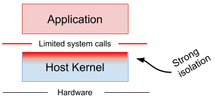
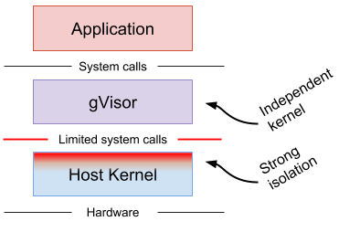

gVisor provides a virtualized environment in order to sandbox untrusted
containers. The system interfaces normally implemented by the host kernel are
moved into a distinct, per-sandbox user space kernel in order to minimize the
risk of an exploit.  gVisor does not introduce large fixed overheads however,
and still retains a process-like model with respect to resource utilization.

## How is this different?

Two other approaches are commonly taken to provide stronger isolation than
native containers.

**Machine-level virtualization**, such as [KVM][kvm] and [Xen][xen], exposes
virtualized hardware to a guest kernel via a Virtual Machine Monitor (VMM). This
virtualized hardware is generally enlightened (paravirtualized) and additional
mechanisms can be used to improve the visibility between the guest and host
(e.g. balloon drivers, paravirtualized spinlocks). Running containers in
distinct virtual machines can provide great isolation, compatibility and
performance (though nested virtualization may bring challenges in this area),
but for containers it often requires additional proxies and agents, and may
require a larger resource footprint and slower start-up times.

**Rule-based execution**, such as [seccomp][seccomp], [SELinux][selinux] and
[AppArmor][apparmor], allows the specification of a fine-grained security policy
for an application or container. These schemes typically rely on hooks
implemented inside the host kernel to enforce the rules. If the surface can be
made small enough (i.e. a sufficiently complete policy defined), then this is an
excellent way to sandbox applications and maintain native performance. However,
in practice it can be extremely difficult (if not impossible) to reliably define
a policy for arbitrary, previously unknown applications, making this approach
challenging to apply universally.

Rule-based execution is often combined with additional layers for
defense-in-depth.

**gVisor** provides a third isolation mechanism, distinct from those above.

gVisor intercepts application system calls and acts as the guest kernel, without
the need for translation through virtualized hardware. gVisor may be thought of
as either a merged guest kernel and VMM, or as seccomp on steroids. This
architecture allows it to provide a flexible resource footprint (i.e. one based
on threads and memory mappings, not fixed guest physical resources) while also
lowering the fixed costs of virtualization. However, this comes at the price of
reduced application compatibility and higher per-system call overhead.

On top of this, gVisor employs rule-based execution to provide defense-in-depth
(details below).

gVisor's approach is similar to [User Mode Linux (UML)][uml], although UML
virtualizes hardware internally and thus provides a fixed resource footprint.

Each of the above approaches may excel in distinct scenarios. For example,
machine-level virtualization will face challenges achieving high density, while
gVisor may provide poor performance for system call heavy workloads.

### Why Go?

gVisor is written in [Go][golang] in order to avoid security pitfalls that can
plague kernels. With Go, there are strong types, built-in bounds checks, no
uninitialized variables, no use-after-free, no stack overflow, and a built-in
race detector. (The use of Go has its challenges too, and isn't free.)

### What about Gofers?

 <!-- For deep linking. -->

[apparmor]: https://wiki.ubuntu.com/AppArmor
[golang]: https://golang.org
[kvm]: https://www.linux-kvm.org
[seccomp]: https://www.kernel.org/doc/Documentation/prctl/seccomp_filter.txt
[selinux]: https://selinuxproject.org
[uml]: http://user-mode-linux.sourceforge.net/
[xen]: https://www.xenproject.org
